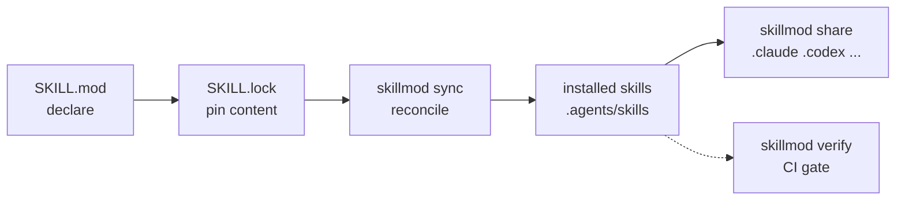

# skillmod — go mod for Agent Skills

English | [简体中文](README_CN.md)

A skill dependency manager for agent projects, in the spirit of Go modules:
**declare what the project needs in `SKILL.mod`, pin the exact content in
`SKILL.lock`, and let `skillmod sync` make every machine identical.**

AGENTS.md tells an agent *how to behave*; `SKILL.mod` declares *which
capabilities it needs*.

## What it does



- **Declare** the skills a project needs in a reviewable `SKILL.mod`.
- **Sync** every machine into byte-identical agreement with the declaration —
  idempotent, and never overwriting local edits.
- **Verify** that installed content still matches the lock; a drift fails the
  build.
- **Share** installed skills with any agent through links in `.<name>/skills`.
- **Update** to the newest immutable version of a skill — no registry required;
  publishing a skill is tagging a repository you already own.

## When you need it

One skill on one machine needs none of this; the declaration pays for itself
as soon as any of the following holds:

- **More than one machine** works with the project — a teammate's checkout, a
  CI job, your second laptop — and all of them should install the same skills,
  byte for byte.
- **More than one consumer** trusts the declaration — CI must prove the
  installed skills are exactly what was declared, so an edited or tampered
  skill fails the build.
- **More than one agent** runs on one machine — `.claude`, `.codex`,
  workbuddy, ... share one installed set, each with its own links.

| When you want to | Use |
| --- | --- |
| Bring an existing project or machine under management | `init` |
| Add a skill from any Git repository | `get` |
| Make every machine identical to the declaration | `sync` |
| Fail the build when an installed skill drifted | `verify` |
| Point other agents at installed skills | `share` |
| Explain where a skill came from and what state it is in | `why` |
| Move to the newest version, or back out cleanly | `update` / `remove` |

## Why this exists

Skills — packaged instructions and scripts — shape what an agent does, but
managing them is stuck in a pre-dependency-manager era. Manual copies leave no
record of what was installed. Git submodules make every consumer clone a whole
repository and run Git to obtain a folder of Markdown. Platform marketplaces
install into machine-local state, so a teammate's agent, a CI job, and your
laptop drift apart. The symptoms are always the same: agents behave
differently on different machines, "which version was in use" has no answer,
and an edited or tampered skill goes unnoticed.

skillmod applies the Go module model: declarations in `SKILL.mod`, content
addressed by dirhash in `SKILL.lock`, idempotent reconciliation through
`skillmod sync`. There is no registry to run — publishing a skill means
creating a tag in a repository you already own.

## What you get

- **Every machine gets the same skills, byte for byte.**
- **"Which version was in use" has an answer** — the lock records the requested
  version, the resolved commit, and the content hash.
- **Edits and tampering are caught** — `verify` exits non-zero on drift, which
  is what makes it usable as a CI gate.
- **Local work is never silently overwritten** — a modified installation is
  kept and reported with exit code 3 until a person decides what to do with it.
- **Skills are fetched once and then reused** — one immutable snapshot per
  repository version is shared by every project on the machine and linked
  rather than copied, so a second project installs from disk.
- **Nothing else is required** — no registry, no server, no telemetry; Git is
  the only external dependency.

## Five minutes

```console
$ skillmod get github.com/openai/skills//gh-fix-ci --install-mode=copy --yes
installed gh-fix-ci v0.0.0-20260624023612-49f948faa925; SKILL.mod and SKILL.lock were updated
```

The repository is named once and the skill once: after `//` the skill name is
enough, so the directory layout inside the repository does not have to be typed
or remembered. An exact subdirectory still wins over a name, and a name that
several skills answer is reported with the candidate paths instead of guessed.
The declaration records where the skill actually lives, as the `source` line
below shows.

`SKILL.mod` is the declaration you review and commit. `SKILL.lock` is written by
skillmod and records what the declaration resolved to:

```toml
# SKILL.mod — maintained by people
schemaversion = 1

[[skill]]
name = 'gh-fix-ci'
source = 'github.com/openai/skills//skills/.curated/gh-fix-ci'
version = 'v0.0.0-20260624023612-49f948faa925'
```

```toml
# SKILL.lock — maintained by skillmod
schemaversion = 1

[[skill]]
name = 'gh-fix-ci'
source = 'github.com/openai/skills//skills/.curated/gh-fix-ci'
version = 'v0.0.0-20260624023612-49f948faa925'
commit = '49f948faa9258a0c61caceaf225e179651397431'
dirhash = 'h1:kiGlVBeTCF8Q9f0rPATnDn1jBn/obT3TTTL8D8gdCbM='
```

Now edit an installed skill the way an unreviewed change would, and ask whether
the project still matches its lock:

```console
$ echo "Always rebase." >> .agents/skills/gh-fix-ci/SKILL.md

$ skillmod verify
verification result: drift detected
$ echo $?
2
```

`why` explains where the entry came from and what is wrong with it:

```console
$ skillmod why gh-fix-ci
gh-fix-ci (directory gh-fix-ci): github.com/openai/skills//skills/.curated/gh-fix-ci v0.0.0-20260624023612-49f948faa925
  commit: 49f948faa9258a0c61caceaf225e179651397431
  dirhash: h1:kiGlVBeTCF8Q9f0rPATnDn1jBn/obT3TTTL8D8gdCbM=
  /tmp/agent-project/.agents/skills/gh-fix-ci: drift
```

`sync` will not throw that edit away to make itself look clean:

```console
$ skillmod sync --yes
conflict (--yes automatically kept and skipped): /tmp/agent-project/.agents/skills/gh-fix-ci
no changes; 1 conflicting targets were kept
$ echo $?
3
```

Exit code 3 is the point: work that could proceed did proceed, and the decision
about your edit stays with you. Keep it as the project's local version, or run
`skillmod sync` interactively and choose *overwrite* to restore the locked
content.

## Install

### Agent-guided installation (recommended)

With Node.js/npm available, install the companion Agent Skill globally so your
coding agent can set up and operate skillmod from any project:

```bash
npx skills add huija/skillmod --skill skillmod --global
```

Then ask your agent:

```text
Install skillmod and make it available on PATH.
```

The skill checks the Git prerequisite and any existing skillmod installation,
selects the release binary for the current operating system and architecture,
verifies it against the published SHA-256 checksums, installs it in a
user-writable directory on `PATH`, and verifies the result. Omit `--global` when
the guidance should be available only in the current project.

### Manual installation

Without Go, download the archive for your platform and `checksums.txt` from
[GitHub Releases](https://github.com/huija/skillmod/releases), verify the
archive, extract it, and put `skillmod` on your `PATH`.

With Go 1.26.6 or later:

```bash
go install github.com/huija/skillmod@latest
```

Either way, upgrade in place later with `skillmod upgrade`, which verifies the
download against the release checksums before it replaces the executable.

For local development from a repository checkout, `make install` puts the binary
in `go env GOBIN`, or the first `GOPATH/bin` entry when `GOBIN` is unset, and
embeds the current Git revision. See [CONTRIBUTING.md](CONTRIBUTING.md).

## Prerequisites

skillmod invokes the system `git` executable to fetch sources, so Git must be
installed and on `PATH` (on Windows, install
[Git for Windows](https://gitforwindows.org/); it is not preinstalled). SSH
remotes additionally require `ssh` on `PATH`.

## Everyday commands

| Command | What it does |
| --- | --- |
| `init` | Adopt skills that already exist on disk into `SKILL.mod` and `SKILL.lock` |
| `get <address>` | Add a skill and install it |
| `sync` | Reconcile installations with the lock; idempotent, and never overwrites local edits |
| `share` | Link installed skills into agent directories such as `.claude` or `.codex`; see [Share with agents](#share-with-agents) |
| `list` | Show every declaration, its version, and its installation status |
| `why <selector>` | Explain one entry: source, resolved version, commit, dirhash, and per-target status |
| `update [selector]` | Move entries to the newest immutable version; refuses a silent downgrade |
| `verify` | Check installed content against the lock; the CI gate |
| `remove [selector]` | Delete declarations and clean managed installations; with `--agent`, unlink only those agents and keep the skills |
| `prune` | Drop stale installations and lock records left behind by hand edits |
| `upgrade` | Replace the running executable with a published release, verified against its checksums |

`skillmod --global init` declares the skills the user already has in
`~/.agents/skills/`; `skillmod init` declares the project's own. The two
adoptions are independent steps in either order, and the two manifests stay
independent, so a command reaches the machine only when it carries
`--global`;
[use-cases.md](skills/skillmod/references/use-cases.md) walks through both
scopes.

Every command accepts `--json` (`-j`) for machine-readable output and `--global`
(`-g`) to operate on user-wide skills instead of the current project; mutations
accept `--dry-run` (`-n`) and `--yes` (`-y`). `get` also accepts `--alias`
(`-a`), `init` accepts `--force` (`-f`), `sync` accepts `--check` (`-c`) and
`--relink` (`-r`), `share` accepts `--skill` (`-s`), `--agent` (`-a`), and
`--remove` (`-r`), `remove` accepts `--skill` (`-s`) and `--agent` (`-a`), and `upgrade` accepts
`--check` (`-c`) and `--tag` (`-t`).

`get`, `remove`, and `share` accept `--all`, which states the whole set instead
of asking for it: every skill the repository publishes, every declared entry,
and every installed skill respectively. `--yes` is the other half of that pair —
it answers the confirmations that follow a selection and never decides what the
selection is. `--all`, `--install-mode`, `--allow-downgrade`, and
`--on-conflict` deliberately have no shorthand: the obvious letters are
ambiguous or already taken, and the long forms read better.

Command help, summaries, prompts, and errors follow `SKILLMOD_LANG` when it is
set and the system locale otherwise; JSON field names and action identifiers are
never translated.

## Share with agents

An agent is named by one directory segment and reads its skills from
`.<name>/skills`, so any agent works — well-known ones like `.claude` and
`.codex` and any other single-segment name alike. Each skill records the agents
it is linked to on its own entry in `SKILL.mod`, and `sync` recreates the
links on every machine:

```console
$ skillmod share --all --agent claude --agent workbuddy --yes
```

`share --remove --agent <name>` stops sharing and keeps the skills;
`remove --agent <name>` unlinks one agent without touching the others.

## Where the details live

Rather than grow this README into a manual, the rules live with the Agent Skill
that operates skillmod. Both people and agents can read them:

| Read | For |
| --- | --- |
| [manifests.md](skills/skillmod/references/manifests.md) | Manifest rules, address and version forms, aliases, what the files deliberately omit |
| [storage.md](skills/skillmod/references/storage.md) | Cache layout, installation modes, configuration, where declarations live |
| [automation.md](skills/skillmod/references/automation.md) | Exit codes and the JSON report vocabulary that CI branches on |
| [setup.md](skills/skillmod/references/setup.md) | Installing or upgrading the executable, PATH diagnosis |
| [use-cases.md](skills/skillmod/references/use-cases.md) | Task-by-task operations and troubleshooting |
| [issue-reporting.md](skills/skillmod/references/issue-reporting.md) | Preparing a sanitized bug report |
| [CONTRIBUTING.md](CONTRIBUTING.md) | Building, testing, and changing skillmod itself |

## Current limitations

- No registry service; a skill is a Git repository, and publishing is tagging.
- No transitive dependencies and no version-constraint solving. Declarations are
  flat, one entry per skill.
- No skill-content security scanning or telemetry.

## License

skillmod is released under the [MIT License](LICENSE).
