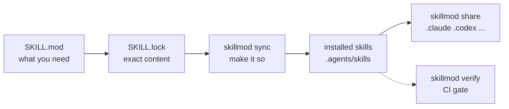

# skillmod — go mod for Agent Skills

English | [简体中文](README_CN.md)

skillmod manages Agent Skills the way Go modules manage dependencies. You
write down what a project needs in `SKILL.mod`, skillmod pins the exact
content in `SKILL.lock`, and `skillmod sync` makes every machine agree.

AGENTS.md tells an agent how to behave. `SKILL.mod` says which skills it
needs to behave that way.

## What it does


```mermaid
flowchart LR
    mod["SKILL.mod<br/>what you need"] --> lock["SKILL.lock<br/>exact content"]
    lock --> sync["skillmod sync<br/>make it so"]
    sync --> inst["installed skills<br/>.agents/skills"]
    inst --> share["skillmod share<br/>.claude .codex ..."]
    inst -.-> verify["skillmod verify<br/>CI gate"]
```

- **Declare** the skills a project needs in `SKILL.mod`, a small file you
  review and commit.
- **Sync** every machine to that declaration. Running it twice changes
  nothing the second time, and it never throws away work you did locally.
- **Verify** that what is installed is still what the lock says. A drift
  exits non-zero, so `verify` drops straight into CI.
- **Share** installed skills with other agents through links, so `.claude`,
  `.codex`, and friends can use one installed set.
- **Update** a skill to its newest version. There is no registry to run:
  publishing a skill means tagging a repository you already own.

The problem it solves: skills shape what an agent does, but managing them by
hand leaves no record of what is installed, and copying them around is how
two machines end up behaving differently. skillmod keeps the declaration,
the exact content, and the installed copies in one place, and tells you when
they stop agreeing.

## When you need it

One skill on one laptop needs none of this. It starts paying off as soon as
any of these is true:

- **More than one machine** works on the project — a teammate's checkout, a
  CI job, your second laptop — and all of them should end up with the same
  skills.
- **Something has to prove it** — CI checks that the installed skills are the
  declared ones, so an edited or tampered skill fails the build.
- **More than one agent** runs on one machine and should share one installed
  set, each with its own links.

| When you want to | Use |
| --- | --- |
| Bring an existing project or machine under management | `init` |
| Add a skill from any Git repository | `get` |
| Make every machine agree with the declaration | `sync` |
| Fail the build when an installed skill drifted | `verify` |
| Point other agents at installed skills | `share` |
| Ask where a skill came from and what state it is in | `why` |
| Move to a newer version, or back out cleanly | `update` / `remove` |

## Five minutes

```console
$ skillmod get openai/skills//gh-fix-ci --install-mode=copy --yes
installed gh-fix-ci v0.0.0-20260624023612-49f948faa925; SKILL.mod and SKILL.lock were updated
```

The host defaults to `github.com`, so `owner/repo` is enough, and `//` picks
the skill inside the repository by name — you do not need to know where in
the repository it lives. An exact path still wins over a name, and a name
that several skills answer is listed with its candidates instead of guessed.
Whatever the skill's real path is, that is what `source` records:

```toml
# SKILL.mod — you maintain this
schemaversion = 1

[[skill]]
name = 'gh-fix-ci'
source = 'github.com/openai/skills//skills/.curated/gh-fix-ci'
version = 'v0.0.0-20260624023612-49f948faa925'
```

```toml
# SKILL.lock — skillmod maintains this
schemaversion = 1

[[skill]]
name = 'gh-fix-ci'
source = 'github.com/openai/skills//skills/.curated/gh-fix-ci'
version = 'v0.0.0-20260624023612-49f948faa925'
commit = '49f948faa9258a0c61caceaf225e179651397431'
dirhash = 'h1:kiGlVBeTCF8Q9f0rPATnDn1jBn/obT3TTTL8D8gdCbM='
```

Now edit an installed skill the way nobody meant to, and ask whether the
project still matches its lock:

```console
$ echo "Always rebase." >> .agents/skills/gh-fix-ci/SKILL.md

$ skillmod verify
verification result: drift detected
$ echo $?
2
```

`why` explains where the entry came from and what is wrong with it:

```console
$ skillmod why gh-fix-ci
gh-fix-ci (directory gh-fix-ci): github.com/openai/skills//skills/.curated/gh-fix-ci v0.0.0-20260624023612-49f948faa925
  commit: 49f948faa9258a0c61caceaf225e179651397431
  dirhash: h1:kiGlVBeTCF8Q9f0rPATnDn1jBn/obT3TTTL8D8gdCbM=
  /tmp/agent-project/.agents/skills/gh-fix-ci: drift
```

`sync` will not throw your edit away just to look clean:

```console
$ skillmod sync --yes
conflict (--yes automatically kept and skipped): /tmp/agent-project/.agents/skills/gh-fix-ci
no changes; 1 conflicting targets were kept
$ echo $?
3
```

Exit code 3 is the point: the work that could go ahead did, and the decision
about your edit stays with you. Keep it as the project's local version, or
run `skillmod sync` interactively and choose *overwrite* to restore the
locked content.

## Install

### Agent-guided installation (recommended)

With Node.js and npm available, install the companion Agent Skill globally so
your coding agent can set up and operate skillmod from any project:

```bash
npx skills add huija/skillmod --skill skillmod --global
```

Then ask your agent to install skillmod and put it on your `PATH`. The skill
checks the Git prerequisite and any existing installation, picks the release
binary for your operating system and architecture, verifies it against the
published checksums, installs it somewhere `PATH` can see, and checks the
result. Drop `--global` when only the current project should get the
guidance.

### Manual installation

Without Go, download the archive for your platform and `checksums.txt` from
[GitHub Releases](https://github.com/huija/skillmod/releases), verify the
archive, extract it, and put `skillmod` on your `PATH`.

With Go 1.26.6 or later:

```bash
go install github.com/huija/skillmod@latest
```

Either way, `skillmod upgrade` later replaces the executable in place, after
verifying the download against the release checksums.

For local development, `make install` builds the binary into `go env GOBIN`
(or the first `GOPATH/bin` entry) and embeds the current Git revision; see
[CONTRIBUTING.md](CONTRIBUTING.md).

## Prerequisites

skillmod shells out to `git` to fetch skills, so Git must be installed and on
`PATH` (on Windows, install [Git for Windows](https://gitforwindows.org/) —
it does not come with the system). SSH remotes also need `ssh` on `PATH`.

## Everyday commands

| Command | What it does |
| --- | --- |
| `init` | Adopt the skills that already exist on disk into `SKILL.mod` and `SKILL.lock` |
| `get <address>` | Add a skill and install it |
| `sync` | Bring installations in line with the lock; safe to run any number of times, and never overwrites local edits |
| `share` | Link installed skills into agent directories such as `.claude` or `.codex`; see [Share with agents](#share-with-agents) |
| `list` | Show every declaration, its version, and its installation status |
| `why <selector>` | Explain one entry: source, resolved version, commit, dirhash, and per-target status |
| `update [selector]` | Move entries to the newest immutable version — the highest tag wins, and only a tagless repository tracks HEAD |
| `verify` | Check installed content against the lock; the CI gate |
| `remove [selector]` | Delete declarations and clean managed installations; with `--agent`, unlink only those agents and keep the skills |
| `prune` | Drop stale installations and lock records left behind by hand edits |
| `upgrade` | Replace the running executable with a published release, verified against its checksums |

`skillmod --global init` adopts the skills the user already has in
`~/.agents/skills/`; `skillmod init` adopts the project's own. The two scopes
are independent — separate manifests, either order — so a command reaches
the machine only when it carries `--global`.

Every command accepts `--json` (`-j`) and `--global` (`-g`). Mutations accept
`--dry-run` (`-n`) and `--yes` (`-y`). `get` also accepts `--alias` (`-a`),
`init` accepts `--force` (`-f`), `sync` accepts `--check` (`-c`),
`--relink` (`-r`), and `--adopt`, `share` accepts `--skill` (`-s`),
`--agent` (`-a`), and `--remove` (`-r`), `remove` accepts `--skill` (`-s`)
and `--agent` (`-a`), and `upgrade` accepts `--check` (`-c`) and `--tag`
(`-t`).

`--json` writes one machine-readable document to stdout and nothing else,
including when the command fails — a failed run carries an `error` field and
still exits with the same code. Human output disappears in that mode, so
scripts never have to tell the two apart. `--adopt` on `sync` takes stock of
skills that were added outside skillmod — by `npx`, by a copy, by hand — and
declares them as local entries with their current content as the baseline;
your files are never rewritten. A plain `sync` only names them and points at
the flag.

`get`, `remove`, and `share` accept `--all`, which states the whole set
instead of asking for it: every skill the repository publishes, every
declared entry — or every entry a repository selector names — and every
installed skill respectively. `--yes` is the other
half of that pair — it answers the confirmations that follow a selection and
never decides what the selection is. `--all`, `--install-mode`,
`--allow-downgrade`, `--on-conflict`, and `--adopt` deliberately have no
shorthand: the obvious letters are ambiguous or already taken, and the long
forms read better.

Both `get` and `remove` take a repository instead of a name. `get
owner/repo//name` installs one skill; `remove owner/repo` lists the skills
declared from that repository and lets you pick which ones go, exactly like
`get` lists the skills a repository publishes. Adding `--all` takes them all
without a terminal, which is how a script says "everything this repository
brought in".

Command help, prompts, summaries, and errors follow `SKILLMOD_LANG` when it
is set and the system locale otherwise. JSON field names and action
identifiers are never translated.

## Share with agents

An agent is named by one directory segment and reads its skills from
`.<name>/skills`, so any agent works — well-known ones like `.claude` and
`.codex` and any other single-segment name alike. Each skill records the
agents it is linked to on its own entry in `SKILL.mod`, and `sync` recreates
the links on every machine:

```console
$ skillmod share --all --agent claude --agent workbuddy --yes
```

`share --remove --agent <name>` stops sharing and keeps the skills;
`remove --agent <name>` unlinks one agent without touching the others.

## Where the details live

This README stays a front door. The rules live with the Agent Skill that
operates skillmod, and both people and agents can read them:

| Read | For |
| --- | --- |
| [manifests.md](skills/skillmod/references/manifests.md) | Manifest rules, address and version forms, aliases, what the files deliberately omit |
| [storage.md](skills/skillmod/references/storage.md) | Cache layout, installation modes, configuration, where declarations live |
| [automation.md](skills/skillmod/references/automation.md) | Exit codes and the JSON report vocabulary that CI branches on |
| [setup.md](skills/skillmod/references/setup.md) | Installing or upgrading the executable, PATH diagnosis |
| [use-cases.md](skills/skillmod/references/use-cases.md) | Task-by-task operations and troubleshooting |
| [issue-reporting.md](skills/skillmod/references/issue-reporting.md) | Preparing a sanitized bug report |
| [CONTRIBUTING.md](CONTRIBUTING.md) | Building, testing, and changing skillmod itself |

## Current limitations

- No registry service; a skill is a Git repository, and publishing is tagging.
- No transitive dependencies and no version-constraint solving. Declarations
  are flat, one entry per skill.
- No skill-content security scanning and no telemetry.

## License

skillmod is released under the [MIT License](LICENSE).
