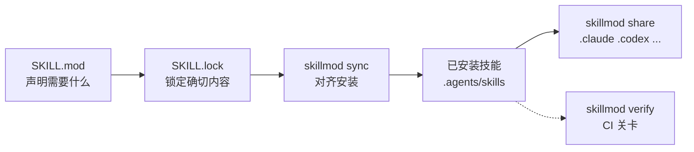

# skillmod —— go mod for Agent Skills

[English](README.md) | 简体中文

skillmod 用 go mod 的方式管理 Agent Skill：在 `SKILL.mod` 里写下项目需要什么，
skillmod 把确切的内容锁进 `SKILL.lock`，再由 `skillmod sync` 让每台机器保持一致。

AGENTS.md 告诉 agent 该怎么做事；`SKILL.mod` 说明它做事需要哪些技能。

## 它做什么



- **声明**：把项目需要的技能写进 `SKILL.mod`，一个小文件，评审后提交。
- **对齐**：`sync` 让每台机器符合这份声明。重复执行不会改变任何东西，
  本地做过的修改也不会被它丢掉。
- **校验**：`verify` 检查已安装内容是否还和锁文件一致。有漂移就以非零码
  退出，可以直接挂进 CI。
- **分享**：通过链接把已安装的技能交给其他 agent，`.claude`、`.codex`
  都能共用同一套安装。
- **更新**：`update` 把技能升级到最新版本。没有需要维护的 registry——
  发布一个技能，就是给自己的仓库打个 tag。

它解决的问题是：技能决定 agent 的行为，但手工管理留不下"装了什么"的
记录，靠拷贝分发，两台机器迟早行为不一致。skillmod 把声明、确切内容和
已安装的副本放在一处，它们不再一致时会告诉你。

## 什么时候需要它

一台机器、一个技能，用不上它。只要下面有一条成立，它就值回价钱：

- **不止一台机器**在做这个项目——同事的检出、CI、你的第二台笔记本——
  它们最后应该拿到同一套技能。
- **需要有人证明这件事**——CI 检查已安装技能就是声明的那批，被改过、
  被篡改的技能会让构建失败。
- **一台机器上跑着多个 agent**，它们共用一套安装，各自持有自己的链接。

| 你想做的事 | 用 |
| --- | --- |
| 把现有项目或机器纳入管理 | `init` |
| 从任意 Git 仓库添加一个技能 | `get` |
| 让每台机器符合声明 | `sync` |
| 技能漂移时让构建失败 | `verify` |
| 把已安装技能交给其他 agent | `share` |
| 查一个技能从哪来、现在什么状态 | `why` |
| 升级到新版本，或干净地退出 | `update` / `remove` |

## 五分钟

```console
$ skillmod get openai/skills//gh-fix-ci --install-mode=copy --yes
已安装 gh-fix-ci v0.0.0-20260624023612-49f948faa925，SKILL.mod 与 SKILL.lock 已更新
```

主机名默认是 `github.com`，所以写 `owner/repo` 就够了；`//` 后面写技能名
就能选中仓库里的技能，不需要知道它在仓库的哪个目录。确实存在的目录优先
于名字；有多个技能同名时报出候选列表，不让它猜。无论技能实际在哪，
`source` 记下来的都是真实路径：

```toml
# SKILL.mod —— 人维护
schemaversion = 1

[[skill]]
name = 'gh-fix-ci'
source = 'github.com/openai/skills//skills/.curated/gh-fix-ci'
version = 'v0.0.0-20260624023612-49f948faa925'
```

```toml
# SKILL.lock —— skillmod 维护
schemaversion = 1

[[skill]]
name = 'gh-fix-ci'
source = 'github.com/openai/skills//skills/.curated/gh-fix-ci'
version = 'v0.0.0-20260624023612-49f948faa925'
commit = '49f948faa9258a0c61caceaf225e179651397431'
dirhash = 'h1:kiGlVBeTCF8Q9f0rPATnDn1jBn/obT3TTTL8D8gdCbM='
```

现在改一下已安装的技能——就像一次没人审批的修改那样——再问项目是否还和
锁文件一致：

```console
$ echo "先 rebase。" >> .agents/skills/gh-fix-ci/SKILL.md

$ skillmod verify
校验结论：有漂移
$ echo $?
2
```

`why` 说明这个条目从哪来、哪里不对：

```console
$ skillmod why gh-fix-ci
gh-fix-ci（目录 gh-fix-ci）：github.com/openai/skills//skills/.curated/gh-fix-ci v0.0.0-20260624023612-49f948faa925
  提交：49f948faa9258a0c61caceaf225e179651397431
  目录哈希：h1:kiGlVBeTCF8Q9f0rPATnDn1jBn/obT3TTTL8D8gdCbM=
  /tmp/agent-project/.agents/skills/gh-fix-ci：drift
```

`sync` 不会为了报告好看丢掉这次修改：

```console
$ skillmod sync --yes
冲突（--yes 自动保留并跳过）: /tmp/agent-project/.agents/skills/gh-fix-ci
没有变更；已保留 1 个冲突目标
$ echo $?
3
```

退出码 3 正是关键：能独立完成的工作已经完成，这次修改怎么处置留给你。
可以把它当作项目的本地版本留着，也可以交互式运行 `skillmod sync`，选择
*overwrite* 恢复锁定的内容。

## 安装

### 使用 Agent 引导安装（推荐）

准备好 Node.js 和 npm 后，全局安装仓库内附带的 Agent Skill，编码 Agent
就能在任意项目里安装和使用 skillmod：

```bash
npx skills add huija/skillmod --skill skillmod --global
```

然后让 Agent 把 skillmod 装好并加进 `PATH`。这个 Skill 会检查 Git 前置
条件和已有的安装，识别当前操作系统与架构，选择对应的 Release 二进制，
按发布的校验和验证后装进 `PATH` 能访问的目录，并验证安装结果。只希望
当前项目用上这份引导时，去掉 `--global`。

### 手动安装

不用 Go 的话，从 [GitHub Releases](https://github.com/huija/skillmod/releases)
下载对应平台的压缩包和 `checksums.txt`，校验后解压，把 `skillmod` 放进
`PATH`。

用 Go 1.26.6 或更高版本时：

```bash
go install github.com/huija/skillmod@latest
```

两种方式之后都可以用 `skillmod upgrade` 原地升级：先按发布校验和验证
下载内容，再替换可执行文件。

本地开发时，`make install` 把二进制装到 `go env GOBIN`（未设置时用第一个
`GOPATH/bin`），并写入当前 Git revision；详见
[CONTRIBUTING.md](CONTRIBUTING.md)。

## 前置条件

skillmod 通过系统的 `git` 获取技能，所以必须安装 Git 并加入 `PATH`
（Windows 请安装 [Git for Windows](https://gitforwindows.org/)，系统默认
不带）；SSH 远程地址还需要 `PATH` 里有 `ssh`。

## 常用命令

| 命令 | 作用 |
| --- | --- |
| `init` | 把磁盘上已有的技能登记进 `SKILL.mod` 和 `SKILL.lock` |
| `get <地址>` | 添加并安装一个技能 |
| `sync` | 按锁文件对齐安装；可以反复执行，且不会覆盖本地修改 |
| `share` | 把已安装技能链接到 agent 目录（如 `.claude`、`.codex`）；见[分享给 agent](#分享给-agent) |
| `list` | 列出全部声明、版本和安装状态 |
| `why <选择器>` | 说明单个条目：来源、解析版本、commit、dirhash 和各目标状态 |
| `update [选择器]` | 把条目更新到最新的不可变版本——最高 tag 优先，只有无 tag 的仓库跟随 HEAD |
| `verify` | 校验已安装内容与锁文件是否一致，即 CI 关卡 |
| `remove [选择器]` | 删除声明和内容未改动的受管安装；带 `--agent` 时只解除这些 agent 的链接，保留技能 |
| `prune` | 清理手工编辑后残留的过期安装和锁记录 |
| `upgrade` | 用已发布的版本替换当前可执行文件，替换前按发布校验和验证 |

`skillmod --global init` 登记用户在 `~/.agents/skills/` 里已有的技能；
`skillmod init` 登记项目自身的技能。两个作用域相互独立——各自的清单，
先后随意——所以只有带 `--global` 的命令才作用于整台机器。

所有命令都支持 `--json`（`-j`）和 `--global`（`-g`）；写操作支持
`--dry-run`（`-n`）和 `--yes`（`-y`）。`get` 还支持 `--alias`（`-a`），
`init` 支持 `--force`（`-f`），`sync` 支持 `--check`（`-c`）、
`--relink`（`-r`）和 `--adopt`，`share` 支持 `--skill`（`-s`）、
`--agent`（`-a`）和 `--remove`（`-r`），`remove` 支持 `--skill`（`-s`）
和 `--agent`（`-a`），`upgrade` 支持 `--check`（`-c`）和 `--tag`（`-t`）。

`--json` 只在 stdout 写一份机器可读的文档，其他什么都没有；命令失败时
也一样——失败的那份带 `error` 字段，退出码不变。这个模式下不再输出人读的
内容，脚本不必去分辨两种格式。`sync` 的 `--adopt` 处理 skillmod 之外新增的
技能——npx 装的、拷贝来的、手动放的——把它们登记为本地条目，并用当前内容
作为基线；文件本身一个字节都不会改。普通 `sync` 只提醒你有这些技能，并
指出这个开关。

`get`、`remove` 和 `share` 支持 `--all`，直接指认整批目标而不进入询问：
分别是仓库发布的全部技能、全部已声明条目（传仓库时则是该仓库声明的全部
条目）、全部已安装技能。`--yes` 是这条分工的另一半——它只回答选择之后的
确认，从不用来决定选择什么。`--all`、`--install-mode`、
`--allow-downgrade`、`--on-conflict` 和 `--adopt` 刻意不设短写：显而易见
的字母会产生歧义或已被占用，且长写更易读。

`get` 和 `remove` 都可以直接传仓库。`get owner/repo//name` 安装一个技能；
`remove owner/repo` 列出这个仓库声明过的技能，让你像 `get` 选技能一样
挑出要删的那些；加上 `--all` 则一次删光，无需终端，这是脚本表达"这个
仓库带来的全部技能"的方式。

命令帮助、交互提示、摘要和错误信息优先采用 `SKILLMOD_LANG`，未设置时跟随
系统 locale；JSON 的字段名和 action 标识不会翻译。

## 分享给 agent

agent 用一个目录段命名，从 `.<名字>/skills` 读取技能，所以任意 agent 都能
用——`.claude`、`.codex` 这样的知名名字和其他任意单段名字一视同仁。每个
技能在自己的 `SKILL.mod` 条目上记录链接到哪些 agent，由 `sync` 在每台机器
上重建链接：

```console
$ skillmod share --all --agent claude --agent workbuddy --yes
```

`share --remove --agent <名称>` 解除分享并保留技能；
`remove --agent <名称>` 只解除一个 agent 的链接，不影响其他 agent。

## 详细文档在哪

这份 README 只当前门。具体规则放在操作 skillmod 的那个 Agent Skill 里，
人和 agent 都可以读：

| 阅读 | 内容 |
| --- | --- |
| [manifests.md](skills/skillmod/references/manifests.md) | 清单规则、地址与版本形态、alias，以及清单刻意不记录的内容 |
| [storage.md](skills/skillmod/references/storage.md) | 缓存布局、安装方式、配置文件、声明与安装的实际位置 |
| [automation.md](skills/skillmod/references/automation.md) | 退出码，以及 CI 需要分支处理的 JSON 报告词表 |
| [setup.md](skills/skillmod/references/setup.md) | 安装或升级可执行文件、PATH 诊断 |
| [use-cases.md](skills/skillmod/references/use-cases.md) | 分场景操作与故障排查 |
| [issue-reporting.md](skills/skillmod/references/issue-reporting.md) | 准备经过脱敏的 Bug 报告 |
| [CONTRIBUTING.md](CONTRIBUTING.md) | 构建、测试和改 skillmod 本身 |

## 当前限制

- 无 registry 服务：一个 skill 就是一个 Git 仓库，发布即打 tag。
- 无传递依赖、无版本约束求解，声明是扁平的，一个技能一条记录。
- 无 skill 内容安全扫描，也无遥测。

## 许可证

skillmod 基于 [MIT License](LICENSE) 发布。
